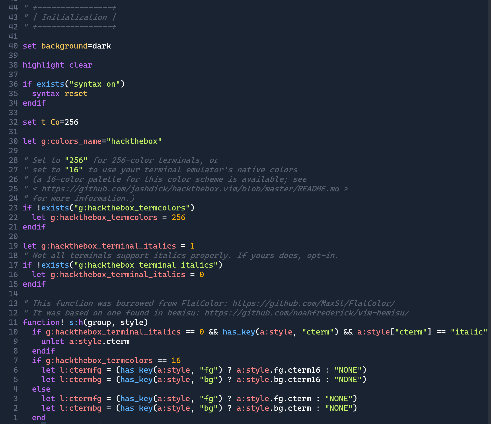

# HackTheBox Vim Colorscheme



Based on the hackthebox theme colors and the OneDark vim theme by
https://github.com/joshdick/onedark.vim

Looks best on terminals with TrueColor support. Best effort 256-color term alternative are provided
as well.

### Windows Terminal

If you'd like this colorscheme in Windows Terminal, paste this into your settings.json

```json
{
  "schemes": [
    {
      "name": "HackTheBox",
      "background": "#1a2332",
      "foreground": "#a4b1cd",
      "black": "#000000",
      "brightBlack": "#666666",
      "white": "#ffffff",
      "brightWhite": "#ffffff",

      "red": "#ff3e3e",
      "brightRed": "#ff8484",
      "green": "#9fef00",
      "brightGreen": "#c5f467",
      "yellow": "#ffaf00",
      "brightYellow": "#ffcc5c",
      "blue": "#004cff",
      "brightBlue": "#5cb2ff",
      "purple": "#9f00ff",
      "brightPurple": "#c16cfa",
      "cyan": "#2ee7b6",
      "brightCyan": "#5cecc6",
      "selectionBackground": "#313f55",
      "cursorColor": "#313f55"
    }
  ]
}
```
